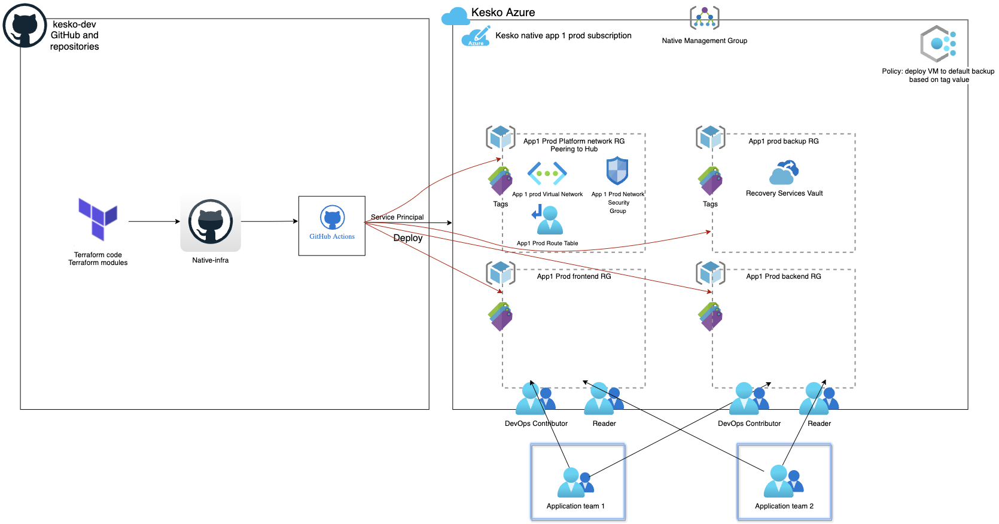

# kesko-azure-platform-template

This repository consists of a platform template to spin up new subscription infra for cloud-native applications requiring its own subscriptions with base framework resources. The default template usage is bootstrapping native medium size app on new subscriptions. 

<mark>Modify the contents of this README.md to reflect the actual repository README.md after using the template.</mark>



The code is implemented using Terraform and the following resources are deployed as default.

1. Platform Resource Group (Application Resource Groups can be included, but should be created by App Team)
2. Platform Virtual Network and Frontend and Backend subnet, route tables and NSGs
3. Recovery Services Vault on subscription with a default Backup Policy
4. Azure Backup policy on subscription for configuring any Virtual Machines to default backup policy. The Backup policy will search for "backup" tag from the VM resources, this tag is also added automatically if not provided to VM at deployment time. 
5. Grant Application team Azure AD groups with roles (DevOps Contributor, Reader)

The repository by default includes two folders, prod_<env> and nonprod_<env>. It is designed to be able to make different configurations on different regions.

## Prerequisites

1. Create a new Subscription. Please note that Azure Native apps use separate subscription for production and non-production includes dev, qa and test (so two subscriptions in total, 1 prod and 1 dev/qa/test)
2. Add az-lz-core Service Principal as owner to this subscription. This is required to add this subscription to correct management group.
3. Add to this subscription to correct management group under kesko-azure-platform-core repository. See core repository for further details. 
4. Create new Service Principal for the new subscription. Create new secret for this SP and store the application (client) ID, Directory (tenant) ID, Subscription ID and secret value. Add this SP as owner to the new subscription. Grant the SP permissions to be able to read Azure AD groups under API Permissions -> Add "Group.Read.All" (Microsoft Graph) permission. Click on the button "Grant admin consent for..". 
5. Create Azure AD groups for Contributor and Reader in Kesko AD and sync to Azure
6. Create repository secrets: Go to Settings -> Secrets -> Actions -> New repository secret. Create the following secrets: TF_VAR_AGENT_CLIENT_ID, TF_VAR_AGENT_CLIENT_SECRET, TF_VAR_TENANT_ID (case sensitive). Use the details from step 4.
7. Create an Environment by clicking Settings under repository -> Environments -> New environment (for example production) -> check "Required reviewers" -> Add the personnel who need to review code before it will be applied to the environment
8. Optionally use Pull Request and request review for code before merging and deploying to production.

## How To Use

On the repository main page, click on the green button "Use this template". Then, input the name of the desired repository, eg kesko-azure-testapp-prod. It's good to use a separate repo for production and dev/qa/test so it follows the subscription model described further in Prerequisites/step 1. This means one repo for production and another for dev/qa/test, depending on needs.

Clone the repository, and modify the locals-common.tf file and locals-<env>.tf files based on requirements (see section Inputs for reference). Use Landing Zone design documentation for resource naming and examples (https://confluence.kesko.fi/display/CC/Resource+Organization). Reserve required IP addressing ranges (https://confluence.kesko.fi/display/CC/Kesko+Azure+ES+Landing+Zone+IP+addressing+plan).

Update env.json, which is used in the pipeline to create Terraform RG, Storage Account, container name and state file name and location and run the backend against it. Make sure there is no conflict with existing backends and specifically with another environment .tfstate files.

### Run in Production
1. Enable production pipeline(s) under repo depending on region and environment in .github\workflows\prod_weu_platform.yaml or .github\workflows\prod_sce_platform.yaml by removing the .tmp suffix from the pipeline filename. Check the pipeline code includes the environment: production on apply stage and this reflects the environment you have added to the repo in Prerequisites/step 7.
2. Update locals-common.tf and locals-prod.tf under prod_weu_platform or prod_sce_platform depending on which region the deployment is to be created
3. Commit and push your changes to main branch or use Pull Request on feature branch, the respective pipeline should pick up the commit automatically and run the pipeline
4. Terraform validate, init and plan runs should apply and await for manual approval before apply-stage when pushing to main.
5. Approve the change by going into the pipeline run and click on the highlighted yellow box awaiting for approval, chech the approve button and approve
6. Check infra on subscription that everything looks correct


### Run in Test, QA, Dev
1. Enable nonproduction pipeline(s) under repo in .github\workflows\nonprod_weu_platform.yaml or .github\workflows\nonprod_sce_platform.yaml by removing the .tmp suffix from the pipeline filename. Check the pipeline code includes the environment: nonproduction on apply stage and this reflects the environment you have added to the repo in Prerequisites/step 7.
2. Update locals-common.tf under respective environment under nonprod_weu_platform or nonprod_sce_platform depending on which region the deployment is to be created. In the locals-common under environments block, you can comment out environments you don't need, however the local files still need to exist for each environment..
3. Commit and push your changes to main branch or use Pull Request on feature branch, the respective pipeline should pick up the commit automatically and run the pipeline
4. Terraform validate, init and plan runs should apply and await for manual approval before apply-stage when pushing to main.
5. Approve the change by going into the pipeline run and click on the highlighted yellow box awaiting for approval, check the approve button and approve
6. Check infra on subscription that everything looks correct

## Inputs
    
env.json    

Name | Description | Type | Example
---- | ----------- | ---- | -------
`subscription_id` | Subscription ID for Terraform backend subscription | string | `"7b063189-7131-4aff-b121-ddd00df9790c"`
`resource_group_name` | Resource Group for Terraform backend | string | `"rg-tfes-platform-iaas-test-shared-sce-001"`
`storage_account_name` | Storage Account name (unique) for Terraform backend | string | `"sttfesiaastestsce001"`
`container_name` | Container name for Terraform backend | string | `"tfesiaastestscebc"`
`key` | Subscription ID for Terraform backend | string | `"tfesiaastestsce.terraform.tfstate"`
`location` | Location for Terraform backend | string | `"swedencentral"`
`tags` | Tags for Terraform backend RG | object | `"Application=Terraform Criticality=Medium BusinessUnit=K-IT OpsCommitment= OpsTeam=CloudOps"`
    
locals-common.tf, basic parameters

Name | Description | Type | Example
---- | ----------- | ---- | -------
`platform_sub` | Subscription ID for platform infra | string | `"7b063189-7131-4aff-b121-ddd00df9790c"`
`platform_location`|The location for the platform resources and backup policy | string | `"westeurope"`
`platform_rsv_name` | The name of the platform Recovery Services Vault  | string |`"rsv-platform-appz-prod-weu-001"`
`platform_backup_tag`| The name backup tag for backup policy  | string |`"backup"`
`platform_backup_tag_value`| The name of the default value of the backup policy tag | string |`"default"`
`platform_application_devops_group`| The name Azure AD DevOps group  | string |`"az-eslz-test-contributor"`
`platform_application_devops_role`| The name of role to assign to the DevOps group (role created in core repo) | string |`"[KGROUP] DevOps-Contributor"`
`platform_application_vnet_operator_role`| The name of role to assign to the DevOps group into platform VNET (role created in core repo) | string |`[KGROUP] Network-Vnet-Operator`
`platform_application_reader_group`| The name Azure AD Reader group  | string |`"az-eslz-test-reader"`
`platform_application_reader_role`| The name of the built-in Reader role | string |`"Reader"`
`tags`| Platform tags | object |`{}`
`environments` | Selection which environment(s) to include in this folder | Object | `"{ prod = local.prod }"`

locals-env.tf

Name | Description | Type | Example
---- | ----------- | ---- | -------
`platform_vnet_rg` | The name of the platform Virtual Network RG | string |`"rg-platform-appz-prod-weu-001"`
`platform_vnet`| Platform VNET configuration object | object | 

The platform_vnet configuration object supports the following:

| Name | Description
|--|--
`name`| A name of the VNET
`addressprefix`|Address prefix for virtual network
`dns_servers`|DNS servers for virtual network
`subnet`|Subnet configuration object (See next chapter)

The platform_vnet.subnet configuration object supports the following:

| Name | Description
|--|--
`name`| A name of subnet within the virtual network
`addressprefix`|Subnet address space
`create_nsg`|Optional parameter to disable NSG creation and attachment for each subnet. By default, NSG is always created
`nsg_inbound_rules`|NSG inbound rules object for each subnet
`nsg_outbound_rules`|NSG outbound rules object for each subnet
`route_table_routes`|Route table routes object for each subnet (See next chapter)
`enforce_private_link_endpoint_network_policies` |Enable or disable subnet Private Link Endpoint Policies

platform.vnet.subnet.delegation object supports the following:

| Name | Description
|--|--
`name`|  A name for this delegation.

platform.vnet.subnet.delegation.service_delegation object supports the following:

| Name | Description
|--|--
`name`| The name of service to delegate to. 
`actions`| A list of Actions which should be delegated. This list is specific to the service to delegate to.


platform_vnet.subnet.route_table_routes object supports the following:

| Name | Description
|--|--
`name`| Route name
`address_prefix`| Address prefix to route
`next_hop_type`| Next Hop type for route
`next_hop_in_ip_address`| Next Hop IP address (optional)

The following example describes an example of the platform_vnet configuration object for reference.


```hcl
    platform_vnet = {
      name           = "vnet-native-appZ-prod-weu-001"
      address_prefix = ["10.246.18.0/24"]
      dns_servers    = ["10.246.116.4", "10.246.116.5"]
      subnet = [
        {
          name          = "snet-native-appZ-fe-weu-001"
          addressprefix = ["10.246.18.0/25"]
          #create_nsg = false
          nsg_inbound_rules = [
          ]
          nsg_outbound_rules = [
          ]
          enforce_private_link_endpoint_network_policies = "false"
          #  delegation = [{
          #    name = "testdelegation"
          #    service_delegation = {
          #      name    = "Microsoft.ContainerInstance/containerGroups"
          #      actions = ["Microsoft.Network/virtualNetworks/subnets/join/action", "Microsoft.Network/virtualNetworks/subnets/prepareNetworkPolicies/action"]
          #    }
          #}]
          route_table_routes = [
            {
              name                   = "DefaultRoute_to_firewall"
              address_prefix         = "0.0.0.0/0"
              next_hop_type          = "VirtualAppliance"
              next_hop_in_ip_address = "10.246.113.4"
            },
          ]
          service_endpoints     = []
        },
        {
          name          = "snet-native-appZ-be-weu-001"
          addressprefix = ["10.246.18.128/25"]
          nsg_inbound_rules = [
            ["AllowManagementInbound_10_248_8_121", "100", "Inbound", "Allow", "*", "*", "10.248.8.121", "10.246.18.128/25"],
            ["AllowManagementInbound_10_248_8_120", "101", "Inbound", "Allow", "*", "*", "10.248.8.120", "10.246.18.128/25"],
            ["AllowManagementInbound_10_248_253_0_24", "102", "Inbound", "Allow", "*", "*", "10.248.253.0/24", "10.246.18.128/25"],
            ["AllowFrontendInbound", "200", "Inbound", "Allow", "*", "*", "10.246.18.0/25", "10.246.18.128/25"],
            ["AllowBackendSubnetInbound", "300", "Inbound", "Allow", "*", "*", "10.246.18.128/25", "10.246.18.128/25"],
            ["AllowAzureLoadbalancerInbound", "4095", "Inbound", "Allow", "*", "*", "AzureLoadBalancer", "10.246.18.128/25"],
            ["DenyVnetInbound", "4096", "Inbound", "Deny", "*", "*", "*", "*"],
          ]
          nsg_outbound_rules = [
          ]
          enforce_private_link_endpoint_network_policies = "false"
          #    delegation = [{
          #      name = "testdelegation"
          #      service_delegation = {
          #        name    = "Microsoft.ContainerInstance/containerGroups"
          #        actions = ["Microsoft.Network/virtualNetworks/subnets/join/action", "Microsoft.Network/virtualNetworks/subnets/prepareNetworkPolicies/action"]
          #      }
          #  }]
          route_table_routes = [
            {
              name                   = "DefaultRoute_to_firewall"
              address_prefix         = "0.0.0.0/0"
              next_hop_type          = "VirtualAppliance"
              next_hop_in_ip_address = "10.246.113.4"
            },
          ]
          service_endpoints = []
        },
      ]
    }
```


## Limitations

For creating NSG rules, the rules support only single port number or range of ports in one rule. Same logic applies for multiple source or destination addresses.

## Troubleshooting

